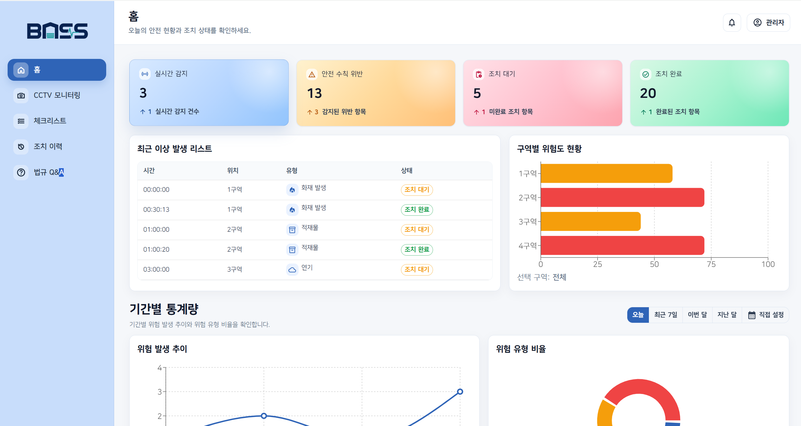
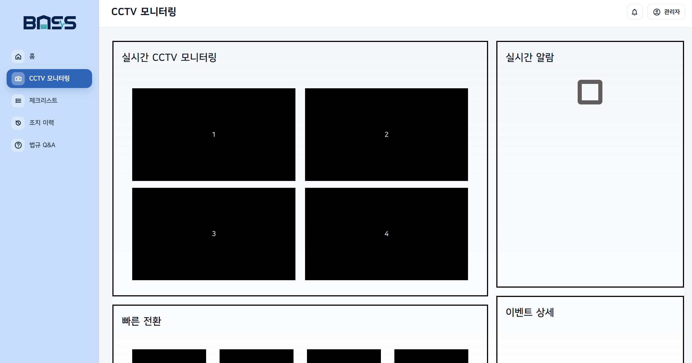
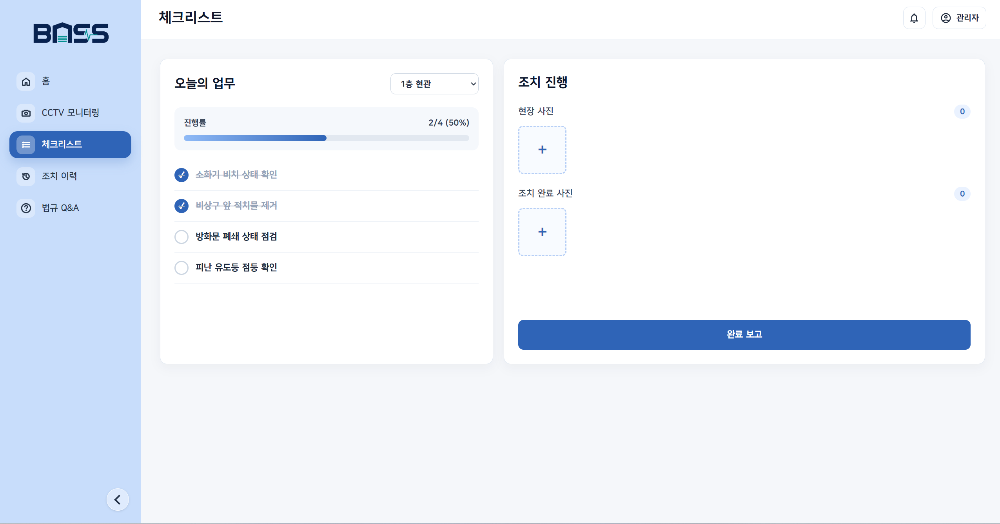
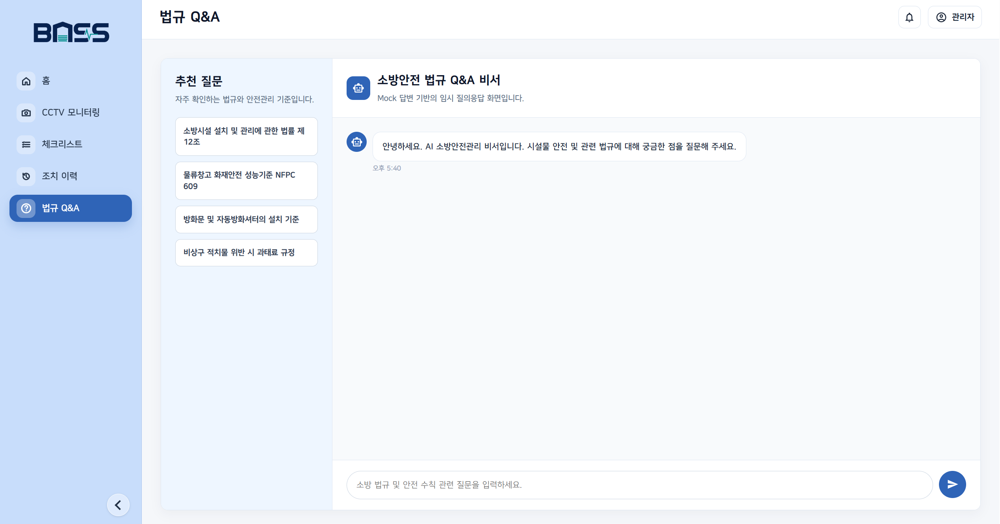
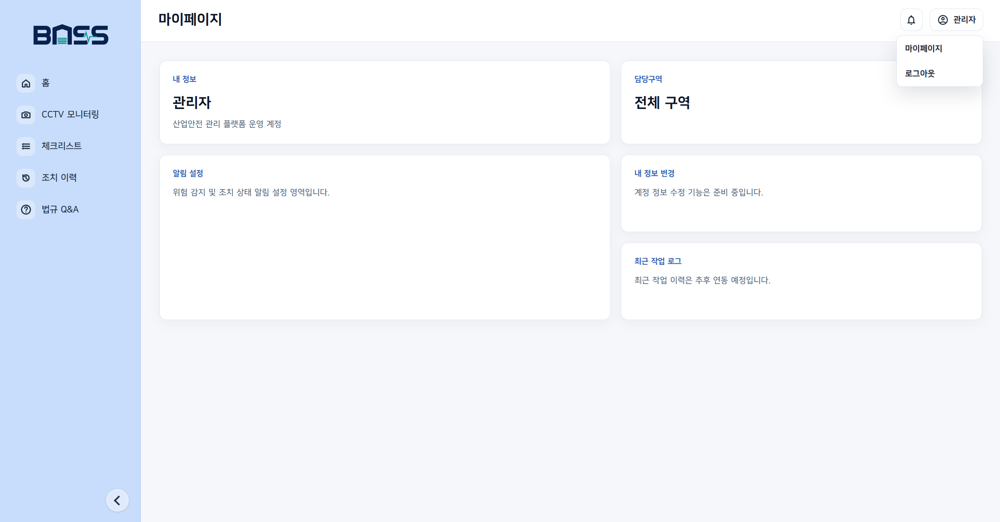

# BOSS Frontend

다현님의 부재로 인한 산업안전 관리 AI 플랫폼 프론트엔드 임시 레포 

## 기술 스택

- React
- JavaScript
- CSS

---

## 주요 기능 
(26.07.13 현재 백엔드 및 AI 모델 연동 전 단계라 Mock 데이터 기반으로 구성)

### 홈 대시보드

- 실시간 감지, 안전 수칙 위반, 조치 대기, 조치 완료 요약 카드
- 최근 이상 발생 리스트
- 구역별 위험도 현황
- 기간별 통계 차트
- 오늘의 리포트
- 종합 안전 등급 및 AI 안전관리 요약
---

### CCTV 모니터링

- 4분할 CCTV 모니터링 화면
- 빠른 전환 영역
- 실시간 알람 영역
- 이벤트 상세 영역
---

### 체크리스트

- 구역별 체크리스트 Mock 데이터
- 업무 완료/미완료 토글
- 진행률 표시
- 현장 사진 및 조치 완료 사진 업로드
- 이미지 미리보기 및 확대 보기
---

### 법규 Q&A

- 추천 질문 목록
- 질문 입력 및 Enter 전송
- Mock 답변 출력
- 챗봇 응답 대기 상태 표시
- 대화 자동 스크롤
---

### 마이페이지

- 내 정보
- 담당구역
- 알림 설정
- 내 정보 변경
- 최근 작업 로그
---


## 실행 방법

의존성 설치:

```bash
npm install
```

개발 서버 실행:

```bash
npm run dev
```
