#  **BOSS Frontend**
<p align=" left">
  <a href="#1-통합-대시보드"></a>
  <a href="#2-cctv-모니터링"></a>
  <a href="#3-점검과-조치"></a>
  <a href="#4-안전-교육"></a>
</p>

> BOSS 산업 소방 안전관리 서비스의 웹 프론트엔드 저장소입니다.
> 현장 CCTV 모니터링부터 점검·조치, 위험 신고, 안전 교육, 보고서, AI 비서까지 
> BOSS의 업무 화면을 하나의 React 애플리케이션으로 제공합니다.

| 바로가기 | 담당 화면 | 주요 기능 |
| --- | --- | --- |
| **Dashboard** | 홈 | 안전 지표, 위험 추이, 교육 현황, 최근 이벤트 |
| **CCTV** | CCTV 모니터링 | 실시간 스트림, AI 감지 이벤트, 담당자 배정 |
| **Inspection & Action** | 체크리스트·이력 관리 | 점검 수행, 조치 요청, 담당자 배정, 승인·반려 |
| **Education** | 안전 교육 | 교육 수강·이수, 관리자 등록, AI 교육 영상 생성 |
| **Reports & Assistant** | 보고서·AI 비서 | 문서 생성·미리보기, 안전 데이터 질의 응답 |

## 🛠️ **기술 스택**

<p>
  
  
  
  
</p>
<p>
  
  
  
  
</p>

| 영역 | 사용 기술 | 적용 내용 |
| --- | --- | --- |
| 애플리케이션 | React, React Router | SPA 화면 구성, 인증 상태 기반 라우팅 |
| 개발·빌드 | Vite | 개발 서버, production bundle, vendor chunk 분리 |
| UI | Material UI, Emotion, CSS | 아이콘, 테마, 반응형 업무 화면과 모달 |
| 데이터 시각화 | Recharts | 위험 추이, 유형 비율, 교육 이수 현황 |
| API | Axios, Fetch API | Backend·Chatbot·Vision 서비스 연동 |
| 문서 미리보기 | docx-preview | 생성된 Word 보고서 브라우저 미리보기 |
| 다국어 | 자체 UI language layer | 한국어·영어 UI 및 알림 문구 전환 |

## 🔎 **애플리케이션 구성**

```text
Browser / React SPA
  ├─ Backend API
  │    ├─ 인증·사용자·알림
  │    ├─ CCTV·이벤트·위험 신고
  │    ├─ 점검·조치·승인 이력
  │    ├─ 교육·영상 생성 작업
  │    └─ 보고서·문서 URL
  ├─ Chatbot API
  │    └─ 안전 관리·교육·법령 질의 응답
  └─ Vision API
       ├─ CCTV 분석 스트림
       ├─ 장비 점검 상태
       └─ 실시간 감지 이벤트
```

## 🔑 **주요 라우트**

| 경로 | 화면 | 비고 |
| --- | --- | --- |
| `/login`, `/signup` | 로그인·회원가입 | 비로그인 사용자 |
| `/` | 통합 대시보드 | 로그인 필요 |
| `/monitoring`, `/monitoringdetail` | CCTV 모니터링 | 스트림·이벤트 상세 |
| `/checklists` | 오늘의 점검·조치 | 현장 업무 수행 |
| `/checklists/management`, `/checklists/inspections` | 체크리스트 관리 | 관리자 기능 |
| `/actions` | 점검·조치 이력 | 완료 이력과 승인 검토 |
| `/education`, `/education-management` | 안전 교육 | 수강·관리 |
| `/board` | 위험 신고 게시판 | 신고 등록·접수 |
| `/risk-management` | 위험도 관리 | 위험요인 관리 |
| `/report` | 보고서 | 생성·목록·미리보기 |
| `/law-qa` | AI 비서 | Chatbot 연동 |
| `/mypage` | 마이페이지 | 계정·알림 관리 |
| `/privacy-policy`, `/terms` | 정책 문서 | 공개 라우트 |

인정보 이용력관 유엑스 공격했어요. 많이 뭐했어요. 많이 생겨있길래 생겨있어요. 그래야지는## 📁 **디렉터리 구조**

```text
frontend/
├─ .github/workflows/       # GitHub Actions 배포
├─ docs/                    # README 화면 이미지
├─ public/                  # 정적 파일
├─ src/
│  ├─ api/                  # 인증 interceptor 등 API 공통 처리
│  ├─ assets/               # 애플리케이션 이미지·아이콘 자산
│  ├─ components/           # 도메인·레이아웃 공통 컴포넌트
│  ├─ config/               # Backend·Chatbot·Vision URL 설정
│  ├─ pages/                # 라우트 단위 페이지
│  ├─ routes/               # React Router 구성
│  ├─ styles/               # 전역·페이지별 스타일
│  ├─ theme/                # Material UI 테마
│  └─ utils/                # 번역, 마스킹, 상태 변환 유틸리티
├─ package.json
└─ vite.config.js
```

## 💡 **주요 기능**

| 번호 | 기능 | 설명 |
| --- | --- | --- |
| 1 | [통합 대시보드](#1-통합-대시보드) | 안전·조치·교육 데이터를 한 화면에서 요약 |
| 2 | [CCTV 모니터링](#2-cctv-모니터링) | Vision 스트림과 위험 이벤트 확인 |
| 3 | [점검과 조치](#3-점검과-조치) | 점검 수행부터 조치 승인까지 업무 흐름 관리 |
| 4 | [안전 교육](#4-안전-교육) | 교육 콘텐츠, 이수 현황, AI 영상 생성 |
| 5 | [위험 신고와 위험도 관리](#5-위험-신고와-위험도-관리) | 현장 신고 접수 및 위험요인 연결 |
| 6 | [보고서와 AI 비서](#6-보고서와-ai-비서) | 안전 문서 생성과 자연어 질의 응답 |
| 7 | [계정·알림·다국어](#7-계정알림다국어) | 인증, 알림 내역, 개인정보 화면, 한·영 전환 |

### 1. 통합 대시보드

- 전체 점검·조치 건수와 처리 현황을 요약합니다.
- 최근 이상 발생, 구역별 위험도, 기간별 위험 추이를 시각화합니다.
- 교육 이수 현황과 사용자·업무 데이터를 권한 범위에 맞게 표시합니다.
- Backend의 점검·조치·교육 API를 조회하여 통계를 생성합니다.

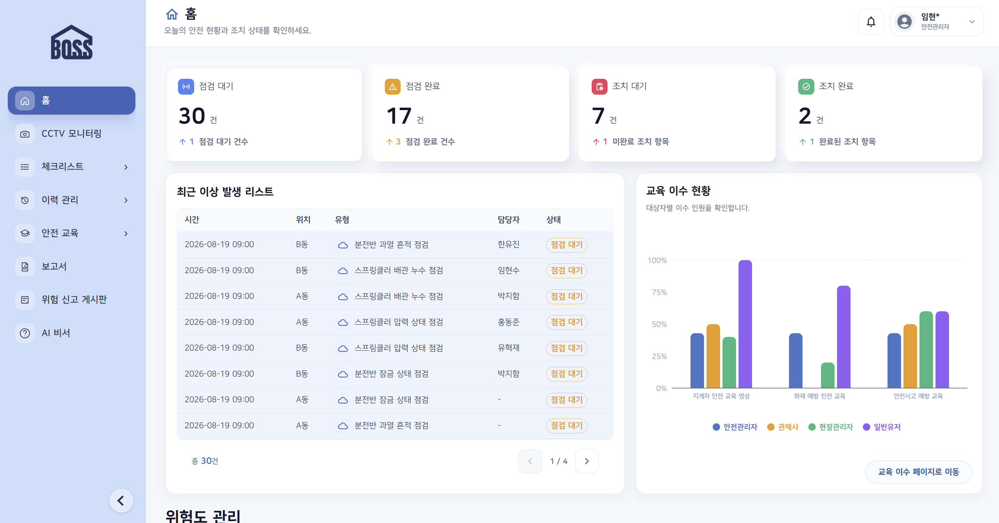

### 2. CCTV 모니터링

- Backend에서 CCTV 구성, 스트림 URL 및 DB에 저장된 감지 이벤트를 조회합니다.
- Vision 서비스에서 실시간 분석 스트림, 장비 상태 및 신규 감지 이벤트를 조회합니다.
- AI Vision 서비스는 감지 이벤트와 캡처 정보를 Backend API로 전송하여 이벤트 이력으로 저장합니다.
- 감지 결과 상세에서 위치·시간·신뢰도를 확인하고 체크리스트 담당자 배정 화면으로 이동할 수 있습니다.
- 운영 환경에서는 reverse proxy를 통해 Vision API를 호출합니다.

<table>
  <tr>
    <td width="50%">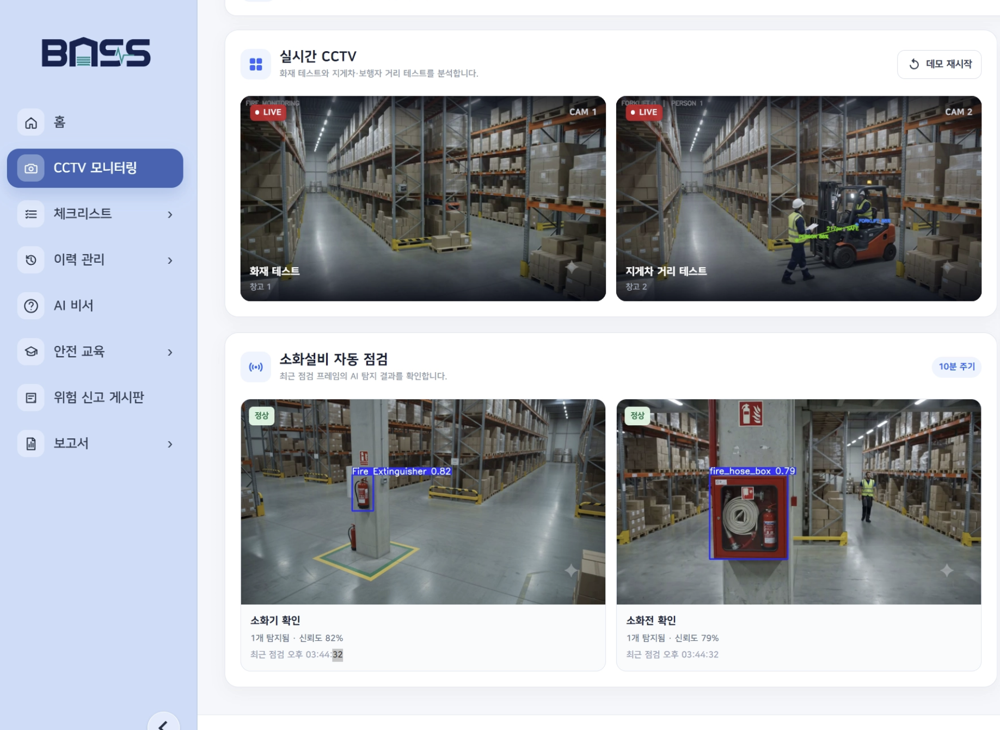</td>
  </tr>
</table>

### 3. 점검과 조치

- 사용자별 점검·조치 목록과 전체 진행률을 제공합니다.
- 점검 메모와 현장 사진을 등록하고, 필요한 항목을 조치 요청으로 전환합니다.
- 관리자는 점검·조치 담당자를 배정하고 주기·적용 구역·진행 상태를 관리합니다.
- 완료 이력에서는 작업 사진, 담당자 입력 내용, AI 사진 재검증 결과를 확인하고 승인 또는 반려합니다.

<table>
  <tr>
    <td width="50%">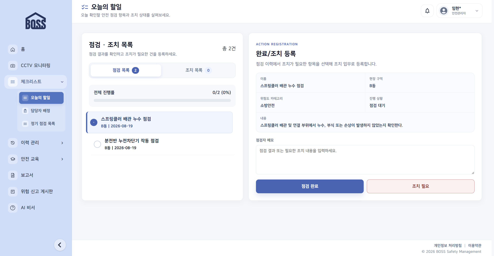</td>
    <td width="50%">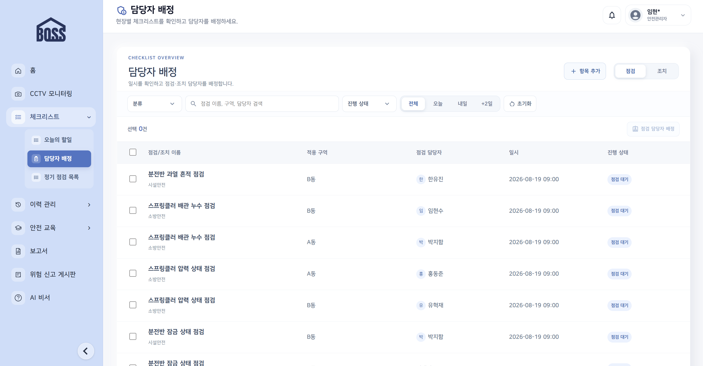</td>
  </tr>
</table>

### 3-1. 이력 관리

- 점검 완료 내역에서 현장 담당자가 완료한 점검의 위치, 유형, 담당자, 사진과 완료 상태를 확인합니다.
- 조치 완료 내역에서 조치 사진을 검토하고 승인 대기·승인 완료 상태와 승인 이력을 관리합니다.

<table>
  <tr>
    <td width="50%">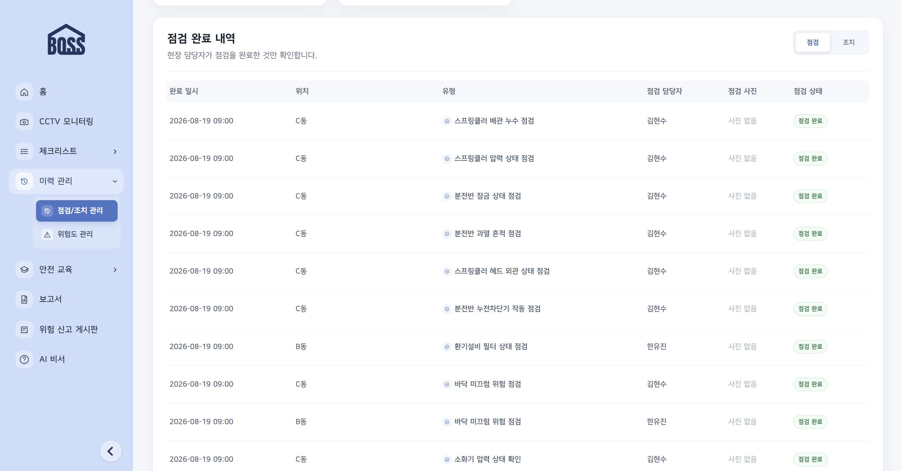</td>
  </tr>
</table>

### 4. 안전 교육

- 사용자는 배정된 교육 영상을 수강하고 과정별 진도와 이수 상태를 확인합니다.
- 관리자는 대상·카테고리·이수 유형·마감일을 지정하여 영상을 등록합니다.
- 교육 이수 현황 모달에서 대상자별 완료 건수와 최근 이수일을 조회합니다.
- AI 교육 영상 생성은 Backend를 통해 비동기 작업을 요청하고, 진행 상태를 폴링하여 결과 검토와 최종 등록을 처리합니다.

<table>
  <tr>
    <td width="50%">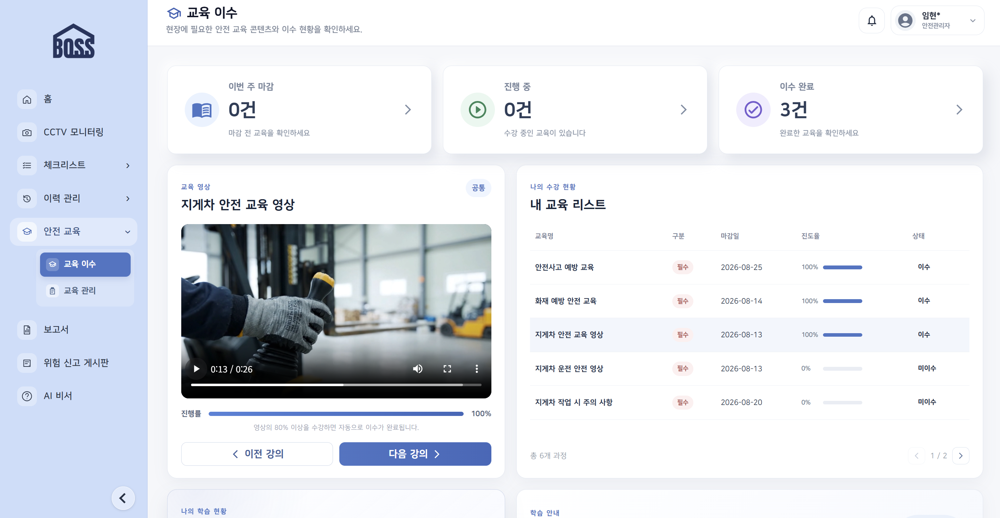</td>
    <td width="50%">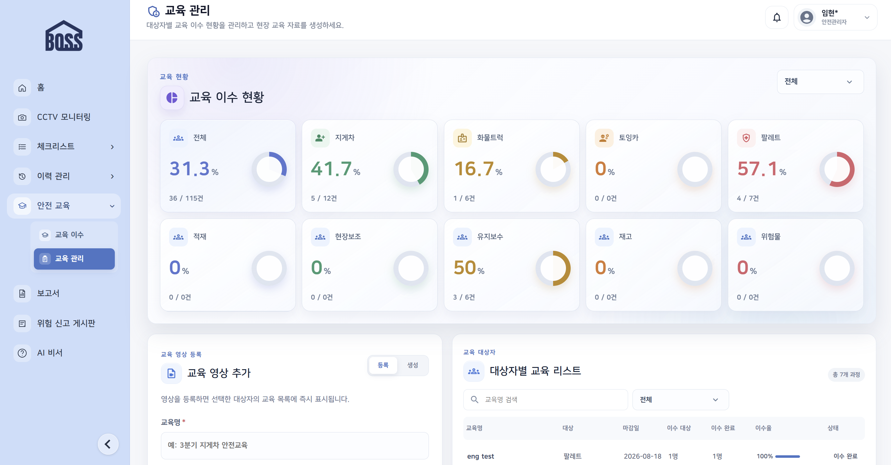</td>
  </tr>
</table>

### 5. 위험 신고와 위험도 관리

- 현장 사용자는 소방안전·시설안전·산업안전·기타 카테고리로 위험 상황과 사진을 등록합니다.
- 관리자는 신고를 접수할 때 위험도 관리에 등록된 위험요인을 선택합니다.
- 신고 카테고리는 원래 분류를 유지하고, 선택한 위험요인은 이후 담당자 배정과 조치 이력의 업무명으로 연결됩니다.
- 위험도 관리에서는 위험요인의 유형·강도·빈도 기반 정보를 조회하고 항목을 추가하거나 관리합니다.

<table>
  <tr>
    <td width="50%">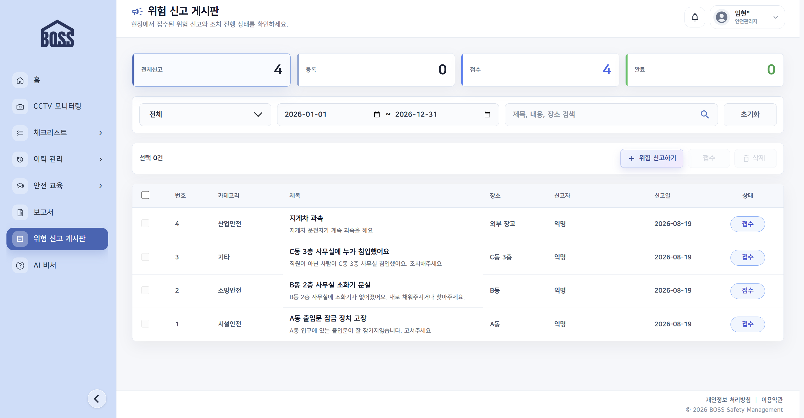</td>
    <td width="50%">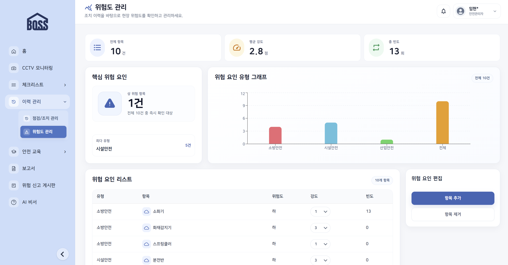</td>
  </tr>
</table>

### 6. 보고서와 AI 비서

- 위험성 평가와 안전 관리 보고서 생성을 Backend에 요청합니다.
- 생성된 보고서 목록을 조회하고 Word 문서를 브라우저에서 미리 봅니다.
- AI 비서는 Chatbot API에 질문과 대화 ID를 전달하여 안전 관리·교육·법령 정보를 질의합니다.
- AI 응답은 서비스가 조회한 업무 데이터와 법령 정보에 기반하며, 프론트는 응답과 오류·대기 상태를 표시합니다.

<table>
  <tr>
    <td width="50%">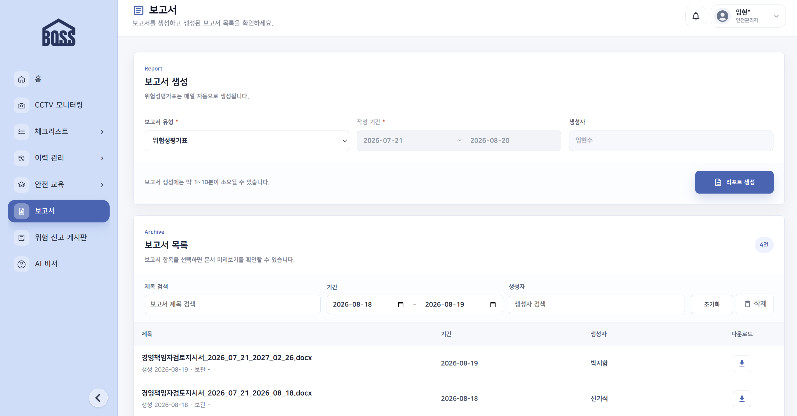</td>
    <td width="50%">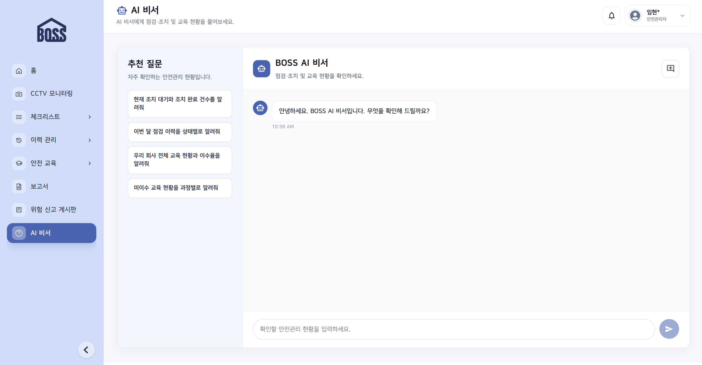</td>
  </tr>
</table>

### 7. 계정·알림·다국어

- 로그인·회원가입·비밀번호 재설정과 JWT 기반 인증 상태를 관리합니다.
- 헤더에서 미확인 알림 건수와 최근 알림을 확인하고, 마이페이지에서 전체 알림 내역을 조회합니다.
- 이름은 화면 노출 시 마지막 글자를 마스킹합니다.
- 로그인 전·후 언어 설정을 유지하며 주요 업무 화면, 모달, 알림, 개인정보 처리방침과 이용약관을 한국어·영어로 제공합니다.

<table>
  <tr>
    <td width="50%">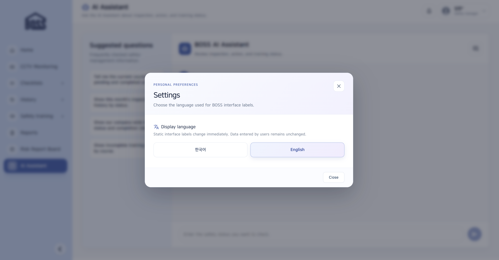</td>
    <td width="50%">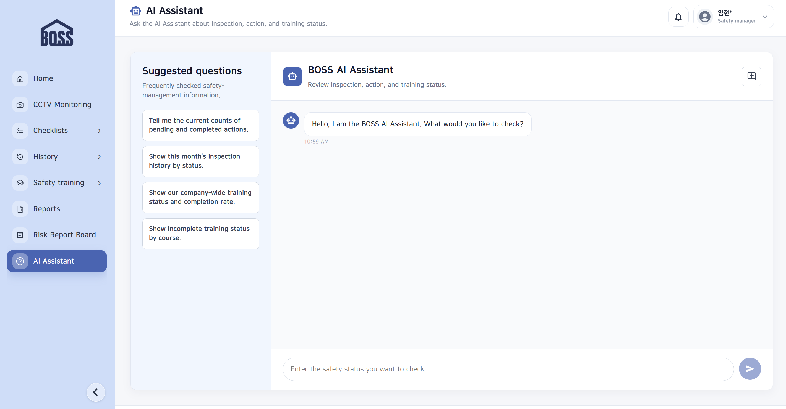</td>
  </tr>
  <tr>
    <td width="50%">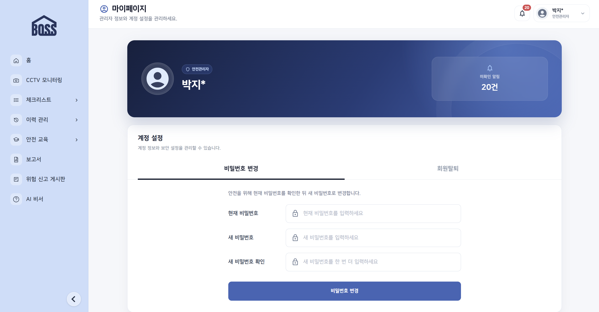</td>
    <td width="50%">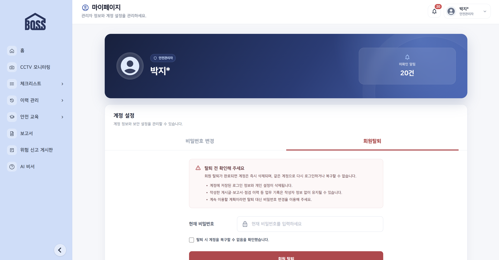</td>
  </tr>
</table>

## 💻 **로컬 개발 실행**

### 요구 사항

- Node.js 20 이상
- npm
- 로컬 또는 접근 가능한 BOSS Backend
- CCTV·AI 비서 화면까지 확인하려면 Chatbot과 Vision 서비스

### 설치 및 실행

```powershell
git clone <frontend-repository-url>
cd frontend
npm ci
```

루트에 `.env.local`을 만들고 서비스 URL을 설정한 뒤 개발 서버를 실행합니다.

```env
VITE_BACKEND_API_URL="http://127.0.0.1:8000"
VITE_CHATBOT_API_URL="http://127.0.0.1:8001"
VITE_VISION_API_URL="http://127.0.0.1:8002"
```

```powershell
npm run dev
```

기본 개발 서버 주소는 Vite가 출력하는 URL을 사용합니다. 일반적으로 `http://localhost:5173`입니다. 환경 변수를 설정하지 않으면 `src/config/api.js`의 위 로컬 주소가 기본값으로 사용되며 URL 끝의 `/`는 설정 과정에서 제거됩니다.

## ⚙️ **환경 변수**

| 변수 | 기본값 | 용도 |
| --- | --- | --- |
| `VITE_BACKEND_API_URL` | `http://127.0.0.1:8000` | 인증과 전체 업무 데이터 API |
| `VITE_CHATBOT_API_URL` | `http://127.0.0.1:8001` | AI 비서 질의 API |
| `VITE_VISION_API_URL` | `http://127.0.0.1:8002` | CCTV 분석 스트림·이벤트 API |

`VITE_` 환경 변수는 브라우저 bundle에 포함됩니다. API key, DB 비밀번호, AWS secret 같은 비밀값을 넣거나 Git에 커밋하지 않습니다.

## ⌨️ **개발 명령**

| 명령 | 설명 |
| --- | --- |
| `npm run dev` | Vite 개발 서버 실행 |
| `npm run build` | production bundle을 `dist/`에 생성 |
| `npm run preview` | 생성된 production bundle 로컬 확인 |
| `npm run lint` | ESLint 정적 검사 |

변경 사항을 배포하기 전에는 최소한 아래 명령을 확인합니다.

```powershell
npm run lint
npm run build
```

## 🔐 **인증과 API 처리**

- 로그인 성공 시 access token, refresh token, 로그인 상태, 사용자 역할을 브라우저 저장소에 기록합니다.
- 공통 인증 interceptor가 Backend 요청의 인증 만료 흐름을 처리합니다.
- 로그인 여부에 따라 인증 화면과 업무 화면 라우트를 분리합니다.
- 메뉴와 일부 관리 기능은 Backend가 반환한 역할 정보를 기준으로 표시합니다.
- 사용자 입력·API 데이터와 정적 UI 번역을 구분합니다. 정적 문구는 `src/utils/en.js`, 알림 문구 변환은 같은 모듈의 알림 번역 규칙에서 관리합니다.

## 🚀 **운영 배포**

운영 배포는 [`.github/workflows/deploy.yml`](.github/workflows/deploy.yml)에서 처리합니다. `main` 브랜치 push 또는 수동 실행(`workflow_dispatch`)을 트리거로 GitHub-hosted runner가 빌드하고, 결과물만 EC2의 정적 파일 경로로 전송합니다.

```text
main push 또는 수동 실행
  → Node.js 20 설정
  → npm ci
  → Vite production build
  → EC2 /var/www/boss 기존 파일 정리
  → dist 결과물 전송
  → Nginx 정적 서비스
```

서버 메모리 사용량을 줄이기 위해 EC2에서 직접 빌드하지 않습니다. GitHub Actions runner가 `dist/`를 만든 뒤 `/var/www/boss`에 복사합니다.

### GitHub Actions Secrets

| Secret | 용도 |
| --- | --- |
| `EC2_HOST` | 배포 대상 EC2 주소 |
| `EC2_USER` | SSH 사용자 |
| `EC2_SSH_KEY` | SSH private key |
| `VITE_BACKEND_API_URL` | 운영 Backend URL |
| `VITE_CHATBOT_API_URL` | 운영 Chatbot URL |
| `VITE_VISION_API_URL` | 운영 Vision URL 또는 reverse proxy 경로 |

Nginx는 React Router의 직접 경로 접근이 동작하도록 SPA fallback을 제공해야 합니다.

```nginx
location / {
    try_files $uri $uri/ /index.html;
}
```

Vision을 같은 도메인의 하위 경로로 전달하는 경우에는 스트림 응답을 위해 proxy buffering과 timeout 설정을 별도로 확인합니다.

## **연동 점검 순서**

1. 로그인 후 Backend 인증 요청과 사용자 역할을 확인합니다.
2. 홈에서 점검·조치·교육 통계가 정상 조회되는지 확인합니다.
3. CCTV 목록, Vision 스트림, 신규 감지 이벤트를 순서대로 확인합니다.
4. 점검 완료 → 조치 요청 → 담당자 배정 → 조치 완료 → 승인·반려 흐름을 확인합니다.
5. 위험 신고 접수 시 선택한 위험요인이 담당자 배정과 조치 이력으로 이어지는지 확인합니다.
6. 교육 등록·이수와 AI 영상 생성 작업의 진행 상태 복구를 확인합니다.
7. 보고서 문서 URL과 Word 미리보기, AI 비서 응답을 확인합니다.
8. 한국어·영어 전환 후 로그인 전·후 언어 설정과 모달·알림·정책 문서를 확인합니다.

## **화면 이미지**

- [홈 대시보드](docs/home_dash.png)
- [CCTV 모니터링](docs/cctv_01.png)
- [체크리스트](docs/checklist_today.png)
- [안전 교육](docs/education_learning.png)
- [AI 비서](docs/ai_chat.png)

화면 이미지는 문서 작성 시점의 예시이며, 실제 데이터와 권한에 따라 카드·메뉴·목록 구성이 달라질 수 있습니다.
